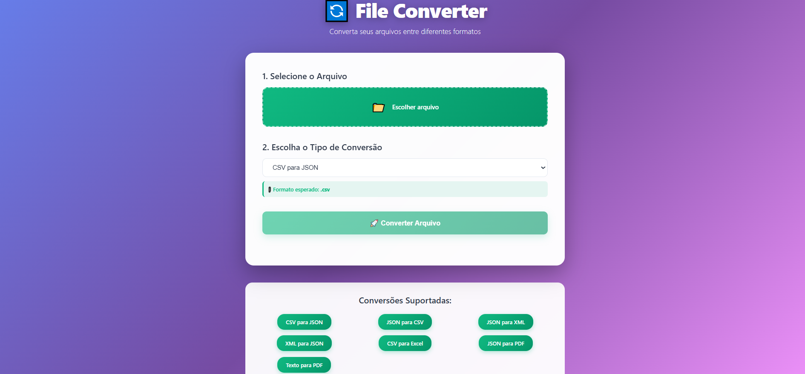
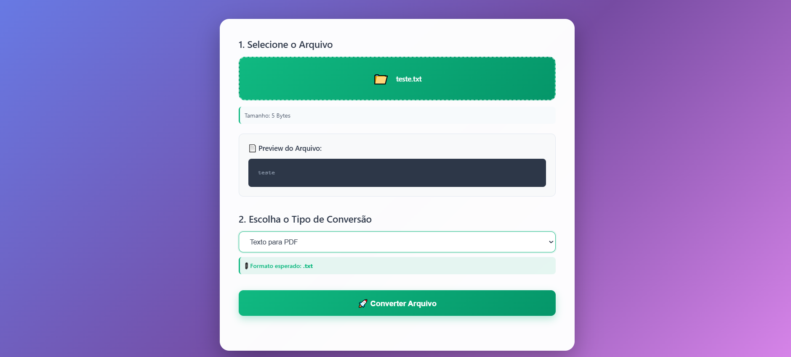
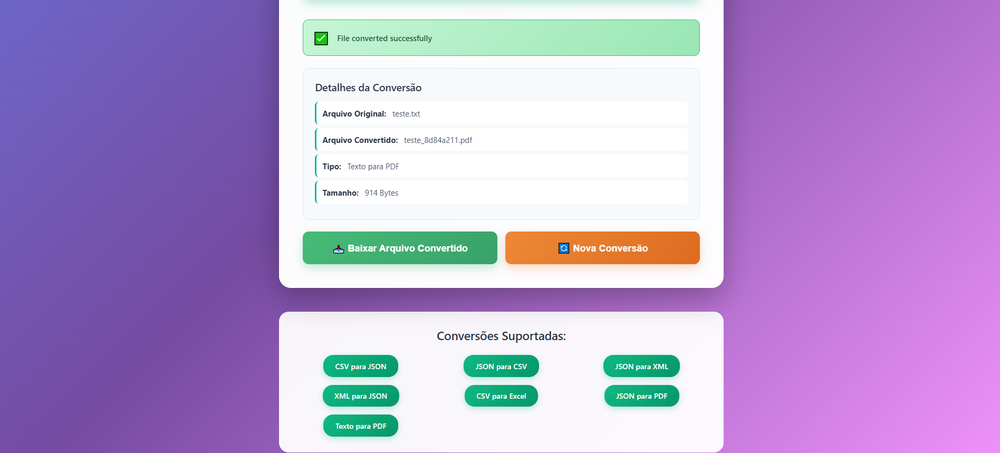

# 🔄 File Converter API

Sistema completo de conversão de arquivos entre diferentes formatos. Spring Boot + Angular + Design Patterns.

[](https://openjdk.org/)
[](https://spring.io/projects/spring-boot)
[](https://angular.io/)
[](https://www.typescriptlang.org/)
[](https://maven.apache.org/)
[](https://file-converter-frontend-eight.vercel.app)

**🌐 [Demo ao Vivo](https://file-converter-frontend.netlify.app/)** | **📖 [Documentação Completa](DOCUMENTATION.md)** | **⚡ [Quick Start](QUICK_START.md)**

---

## 📋 Índice

- [Sobre o Projeto](#sobre-o-projeto)
- [Tecnologias](#tecnologias)
- [Funcionalidades](#funcionalidades)
- [Arquitetura](#arquitetura)
- [Instalação](#instalação)
- [Como Usar](#como-usar)
- [Endpoints da API](#endpoints-da-api)
- [Deploy](#deploy)
- [Autor](#autor)

---

## 📋 Sobre o Projeto

API REST completa para conversão de arquivos entre múltiplos formatos populares. Desenvolvido com arquitetura full-stack demonstrando boas práticas de engenharia de software, design patterns e princípios SOLID.

**Principais características:**

- 🔄 **7 tipos de conversão** - CSV, JSON, XML, Excel, PDF
- 🏗️ **Design Patterns** - Strategy, Factory, Dependency Injection
- 🎯 **SOLID Principles** - Código limpo e manutenível
- 📚 **API REST** - Documentação Swagger completa
- 🎨 **Interface Moderna** - Angular com UI responsiva
- ✅ **Pronto para produção** - Deploy facilitado

---

## ✨ Funcionalidades

## ✨ Funcionalidades

### Conversões Suportadas

| De → Para   | Status | Biblioteca                   |
| ----------- | ------ | ---------------------------- |
| CSV → JSON  | ✅     | Apache Commons CSV + Jackson |
| JSON → CSV  | ✅     | Jackson + Apache Commons CSV |
| JSON → XML  | ✅     | Jackson XML                  |
| XML → JSON  | ✅     | Jackson XML                  |
| CSV → Excel | ✅     | Apache POI                   |
| Texto → PDF | ✅     | iText 7                      |
| JSON → PDF  | ✅     | iText 7 (tabelas formatadas) |

### Recursos da API

- ✅ **Upload de arquivos** - Suporte multipart/form-data até 10MB
- ✅ **Conversão em tempo real** - Processamento rápido e eficiente
- ✅ **Download direto** - Arquivo convertido pronto para uso
- ✅ **Documentação Swagger** - Endpoints totalmente documentados
- ✅ **Tratamento de erros** - Mensagens claras e códigos HTTP corretos
- ✅ **CORS configurado** - Pronto para integração frontend
- ✅ **Logs estruturados** - Debug facilitado

### Interface Web

- 📁 **Upload intuitivo** - Interface drag & drop
- 🎨 **Design moderno** - Gradientes e animações suaves
- 📱 **Totalmente responsivo** - Desktop, tablet e mobile
- ⚡ **Feedback visual** - Loading states e notificações
- 📊 **Detalhes da conversão** - Informações sobre arquivo gerado

---

## 🚀 Tecnologias

### Backend

| Tecnologia             | Versão | Uso                           |
| ---------------------- | ------ | ----------------------------- |
| **Java**               | 17     | Linguagem de programação      |
| **Spring Boot**        | 3.2.2  | Framework backend             |
| **Maven**              | 3.8+   | Gerenciamento de dependências |
| **Apache Commons CSV** | 1.10.0 | Processamento de CSV          |
| **Jackson**            | -      | Serialização JSON/XML         |
| **Apache POI**         | 5.2.5  | Manipulação de Excel          |
| **iText 7**            | 7.2.5  | Geração de PDF                |
| **SpringDoc OpenAPI**  | 2.3.0  | Documentação Swagger          |
| **Lombok**             | -      | Redução de boilerplate        |

### Frontend

| Tecnologia     | Versão | Uso                         |
| -------------- | ------ | --------------------------- |
| **Angular**    | 17     | Framework frontend          |
| **TypeScript** | 5.3    | Linguagem fortemente tipada |
| **RxJS**       | 7.8    | Programação reativa         |
| **CSS3**       | -      | Estilização moderna         |

---

## 🏗️ Arquitetura e Design Patterns

### Arquitetura em Camadas

```
┌─────────────────────────────────────────┐
│         Camada de Apresentação          │
│              (Angular 17)               │
│   Components | Services | Models        │
└──────────────┬──────────────────────────┘
               │ HTTP REST
               ▼
┌─────────────────────────────────────────┐
│          Camada de API REST             │
│         (Spring Boot 3.2.2)             │
│   Controllers | Exception Handlers      │
└──────────────┬──────────────────────────┘
               │
               ▼
┌─────────────────────────────────────────┐
│       Camada de Lógica de Negócio       │
│            (Services)                   │
│   FileConversionService                 │
└──────────────┬──────────────────────────┘
               │
               ▼
┌─────────────────────────────────────────┐
│      Camada de Conversão (Strategy)     │
│         ConverterFactory                │
├─────────────────────────────────────────┤
│  CsvToJson | JsonToCsv | JsonToXml     │
│  XmlToJson | CsvToExcel | TextToPdf    │
│  JsonToPdf                              │
└─────────────────────────────────────────┘
```

### Design Patterns Implementados

#### 1. **Strategy Pattern**

```java
public interface FileConverter {
    void convert(InputStream input, OutputStream output);
}

// Cada conversor é uma estratégia diferente
public class CsvToJsonConverter implements FileConverter { ... }
public class JsonToPdfConverter implements FileConverter { ... }
```

**Benefícios:**

- ✅ Fácil adicionar novos conversores
- ✅ Código testável isoladamente
- ✅ Open/Closed Principle

#### 2. **Factory Pattern**

```java
@Component
public class ConverterFactory {
    public FileConverter getConverter(ConversionType type) {
        return converters.get(type.name());
    }
}
```

**Benefícios:**

- ✅ Centraliza criação de objetos
- ✅ Esconde complexidade de instanciação
- ✅ Facilita manutenção

#### 3. **Dependency Injection**

```java
@RestController
public class FileConverterController {
    private final FileConversionService service;

    // Spring injeta automaticamente
    public FileConverterController(FileConversionService service) {
        this.service = service;
    }
}
```

**Benefícios:**

- ✅ Baixo acoplamento
- ✅ Fácil fazer testes (mocks)
- ✅ Inversão de dependências

### Princípios SOLID Aplicados

| Princípio                 | Implementação                                             |
| ------------------------- | --------------------------------------------------------- |
| **S**ingle Responsibility | Cada conversor tem uma única responsabilidade             |
| **O**pen/Closed           | Extensível via novos conversores sem modificar existentes |
| **L**iskov Substitution   | Qualquer FileConverter pode substituir outro              |
| **I**nterface Segregation | Interface FileConverter enxuta e focada                   |
| **D**ependency Inversion  | Dependemos de abstrações (interfaces), não implementações |

---

## 🔧 Instalação e Execução

### Pré-requisitos

```bash
# Verificar versões
java -version    # Java 17+
node -v          # Node.js 18+
npm -v           # npm 9+
```

### Quick Start

#### 1️⃣ Clone o repositório

```bash
git clone https://github.com/DiegoRapichan/java-file-converter.git
cd java-file-converter
```

#### 2️⃣ Backend (Terminal 1)

```bash
cd backend
./mvnw clean install -DskipTests
./mvnw spring-boot:run
```

✅ Backend: `http://localhost:8080`  
📚 Swagger: `http://localhost:8080/swagger-ui.html`

#### 3️⃣ Frontend (Terminal 2)

```bash
cd frontend
npm install
npm start
```

✅ Frontend: `http://localhost:4200`

---

## 💻 Como Usar

### Via Interface Web

1. Acesse `http://localhost:4200`
2. Clique em "Escolher arquivo"
3. Selecione o tipo de conversão desejado
4. Clique em "Converter Arquivo"
5. Faça download do arquivo convertido

### Via API REST (cURL)

```bash
# Converter CSV para JSON
curl -X POST http://localhost:8080/api/convert/upload \
  -F "file=@data.csv" \
  -F "conversionType=CSV_TO_JSON"

# Download do arquivo convertido
curl -O http://localhost:8080/api/convert/download/data_abc123.json
```

---

## 📚 Endpoints da API

### Base URL

```
http://localhost:8080/api
```

### Endpoints Disponíveis

#### 📋 Listar Tipos de Conversão

```http
GET /convert/types
```

**Response:**

```json
[
  {
    "type": "CSV_TO_JSON",
    "description": "CSV para JSON"
  },
  {
    "type": "JSON_TO_XML",
    "description": "JSON para XML"
  }
]
```

#### 🔄 Converter Arquivo

```http
POST /convert/upload
Content-Type: multipart/form-data

Parameters:
- file: Arquivo para conversão (max 10MB)
- conversionType: Tipo de conversão
```

**Response (sucesso):**

```json
{
  "success": true,
  "message": "File converted successfully",
  "originalFileName": "data.csv",
  "convertedFileName": "data_a1b2c3d4.json",
  "conversionType": "CSV_TO_JSON",
  "fileSizeBytes": 2048,
  "downloadUrl": "/api/convert/download/data_a1b2c3d4.json"
}
```

**Response (erro):**

```json
{
  "success": false,
  "message": "Conversion failed",
  "errorDetails": "Invalid CSV format"
}
```

#### ⬇️ Download do Arquivo Convertido

```http
GET /convert/download/{fileName}
```

**Response:** File (binary)  
**Headers:** `Content-Disposition: attachment; filename="data.json"`

#### 🏥 Health Check

```http
GET /convert/health
```

**Response:**

```json
{
  "status": "File Converter API is running",
  "version": "1.0.0"
}
```

### 📖 Documentação Interativa

Swagger UI disponível em:

```
http://localhost:8080/swagger-ui.html
```

**Features:**

- ✅ Teste todos os endpoints diretamente no navegador
- ✅ Visualize schemas de request/response
- ✅ Veja códigos de status HTTP
- ✅ Download de especificação OpenAPI

---

## 🌐 Deploy

### 🚀 Aplicação em Produção

- **Frontend:** https://file-converter-frontend.netlify.app/
- **Backend API:** https://file-converter-api-udbk.onrender.com
- **Swagger UI:** https://file-converter-api-udbk.onrender.com/swagger-ui.html

### Backend (Render)

Este projeto está deployado no Render usando Docker.

**Passos:**

1. Criar conta no Render
2. New Web Service → GitHub
3. Configurar Dockerfile
4. Deploy automático via Git push

### Frontend (Vercel)

**Passos:**

```bash
cd frontend
npm run build
vercel --prod

---

## 📁 Estrutura do Projeto

```

java-file-converter/
│
├── backend/ # 🔧 Backend Spring Boot
│ ├── src/
│ │ ├── main/
│ │ │ ├── java/com/fileconverter/
│ │ │ │ ├── config/ # Configurações (CORS, Swagger)
│ │ │ │ ├── controller/ # REST Controllers
│ │ │ │ ├── service/ # Lógica de negócio
│ │ │ │ ├── converter/ # Implementações Strategy
│ │ │ │ │ ├── CsvToJsonConverter.java
│ │ │ │ │ ├── JsonToCsvConverter.java
│ │ │ │ │ ├── JsonToXmlConverter.java
│ │ │ │ │ ├── XmlToJsonConverter.java
│ │ │ │ │ ├── CsvToExcelConverter.java
│ │ │ │ │ ├── TextToPdfConverter.java
│ │ │ │ │ └── JsonToPdfConverter.java
│ │ │ │ ├── factory/ # Factory Pattern
│ │ │ │ │ └── ConverterFactory.java
│ │ │ │ ├── model/ # DTOs e Enums
│ │ │ │ ├── exception/ # Exception Handlers
│ │ │ │ └── FileConverterApplication.java
│ │ │ └── resources/
│ │ │ └── application.properties
│ │ └── test/
│ ├── input/ # Arquivos de exemplo
│ ├── output/ # Arquivos convertidos
│ ├── pom.xml
│ └── README.md
│
├── frontend/ # 🎨 Frontend Angular
│ ├── src/
│ │ ├── app/
│ │ │ ├── components/
│ │ │ │ └── file-converter/ # Componente principal
│ │ │ │ ├── file-converter.component.ts
│ │ │ │ ├── file-converter.component.html
│ │ │ │ └── file-converter.component.css
│ │ │ ├── services/
│ │ │ │ └── file-conversion.service.ts
│ │ │ ├── models/
│ │ │ │ └── conversion.model.ts
│ │ │ ├── app.component.ts
│ │ │ └── app.config.ts
│ │ ├── environments/ # Configurações de ambiente
│ │ ├── styles.css # Estilos globais
│ │ └── index.html
│ ├── package.json
│ ├── angular.json
│ └── README.md
│
├── README.md # 📖 Este arquivo
├── DOCUMENTATION.md # 📚 Documentação técnica completa
└── QUICK_START.md # ⚡ Guia rápido de instalação

````

### Componentes Backend (17 arquivos Java)

| Componente | Responsabilidade | Padrão |
|-----------|------------------|--------|
| `FileConverterApplication` | Entry point Spring Boot | - |
| `FileConverterController` | Endpoints REST | MVC |
| `FileConversionService` | Lógica de conversão | Service |
| `ConverterFactory` | Gerencia conversores | Factory |
| `FileConverter` (interface) | Contrato dos conversores | Strategy |
| 7 Conversores | Implementações específicas | Strategy |
| `ConversionType` (enum) | Tipos de conversão | Enum |
| `ConversionResponse` (DTO) | Resposta padronizada | DTO |
| `GlobalExceptionHandler` | Tratamento de erros | Exception Handler |
| `CorsConfig` | Configuração CORS | Config |
| `OpenApiConfig` | Swagger/OpenAPI | Config |

---

## 🧪 Testes

### Backend
```bash
cd backend
./mvnw test
````

### Frontend

```bash
cd frontend
ng test
```

---

## 📸 Screenshots

### Tela Principal



### Upload e Conversão



### Resultado



---

## 💡 Exemplos de Uso

### Exemplo 1: CSV → JSON

**Input (data.csv):**

```csv
name,age,city,occupation
John Doe,30,New York,Software Engineer
Jane Smith,25,Los Angeles,Data Scientist
Bob Johnson,35,Chicago,Product Manager
```

**Output (data.json):**

```json
[
  {
    "name": "John Doe",
    "age": "30",
    "city": "New York",
    "occupation": "Software Engineer"
  },
  {
    "name": "Jane Smith",
    "age": "25",
    "city": "Los Angeles",
    "occupation": "Data Scientist"
  },
  {
    "name": "Bob Johnson",
    "age": "35",
    "city": "Chicago",
    "occupation": "Product Manager"
  }
]
```

### Exemplo 2: JSON → Excel

**Input (products.json):**

```json
[
  { "product": "Laptop", "price": 1299.99, "stock": 45 },
  { "product": "Mouse", "price": 29.99, "stock": 150 },
  { "product": "Keyboard", "price": 79.99, "stock": 80 }
]
```

**Output:** Planilha Excel (.xlsx) com:

- Headers formatados (negrito, fundo cinza)
- Colunas auto-ajustadas
- Dados tabulados

### Exemplo 3: Texto → PDF

**Input (document.txt):**

```
File Converter - Sistema de Conversão
Desenvolvido com Java Spring Boot e Angular
Design Patterns: Strategy e Factory
```

**Output:** PDF formatado com cada linha como parágrafo

---

## 🎯 Próximas Funcionalidades

- [ ] Suporte para mais formatos (YAML, TOML)
- [ ] Conversão de imagens (PNG, JPEG, SVG)
- [ ] Batch conversion (múltiplos arquivos)
- [ ] Histórico de conversões
- [ ] Autenticação de usuários
- [ ] Limites de upload configuráveis

---

## 🤝 Contribuindo

Contribuições são bem-vindas! Para contribuir:

1. Fork o projeto
2. Crie uma branch para sua feature (`git checkout -b feature/NovaFeature`)
3. Commit suas mudanças (`git commit -m 'Adiciona NovaFeature'`)
4. Push para a branch (`git push origin feature/NovaFeature`)
5. Abra um Pull Request

---

## 👨‍💻 Autor

**Diego Rapichan**

Desenvolvedor Full Stack com experiência em Java, Spring Boot, Node.js e Angular.

- 🌐 GitHub: [@DiegoRapichan](https://github.com/DiegoRapichan)
- 💼 LinkedIn: [Diego Rapichan](https://linkedin.com/in/diego-rapichan)
- 📧 Email: direrapichan@gmail.com
- 📍 Localização: Apucarana, PR - Brasil

**Outros Projetos:**

- [Autoflex Inventory System](https://github.com/DiegoRapichan/autoflex-inventory-system) - Spring Boot + React + PostgreSQL
- [Task Manager API](https://github.com/DiegoRapichan/task-manager-api) - Node.js + Express + PostgreSQL
- [Learning Project Suggester](https://github.com/DiegoRapichan/learning-project-suggester-api) - Node.js API

---

## 📜 Licença

Este projeto está sob a licença MIT. Veja o arquivo [LICENSE](LICENSE) para mais detalhes.

---

## 🙏 Agradecimentos

- Spring Framework Team
- Angular Team
- Apache Software Foundation (POI, Commons CSV)
- iText Team

---

**⭐ Se este projeto foi útil, considere dar uma estrela!**

---

_Desenvolvido por Diego Rapichan_
